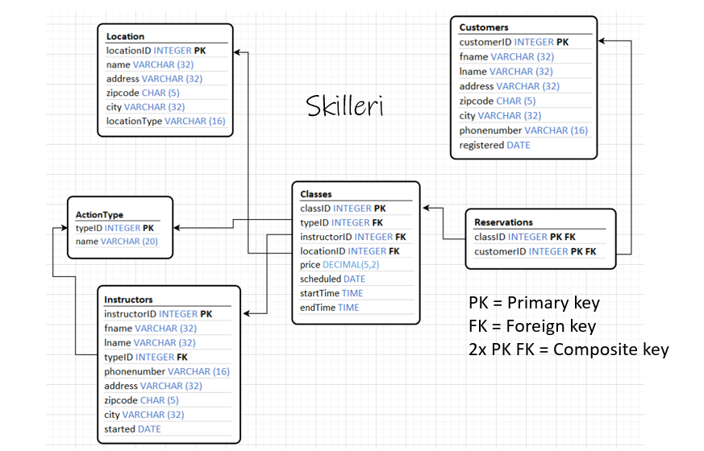

# Skilleri database project

## Project description

My first MySQL database project that I made during Laurea's (UAS) database course.
We were tasked with designing a schema for a database that could be used in an application.
After the design phase we were to create the database and it's tables using the server provided by Laurea.

My application was Skilleri, which is a reservation system for instructors in yoga, dancing and martial arts.
The database holds data of instructors, facilities, customers, and reservations.

After the course ended we had no access to Laurea's server, so
I installed MySQL Community local server to be able to present my project properly.

## Course requirements

- Database has atleast **5** tables
- Database has atleast **4** different datatypes
- **10** meaningful queries to test database

## Server

- MySQL Community local server

## Languages

- SQL

## How to run?

Download MySQL community server: https://dev.mysql.com/downloads/mysql/

How to set-up local MySQL community server: 
https://www.youtube.com/watch?v=2HQC94la6go&t=3s&ab_channel=BlaineRobertson

## Skilleri schema

